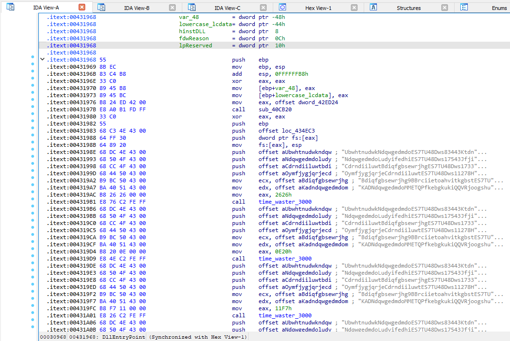
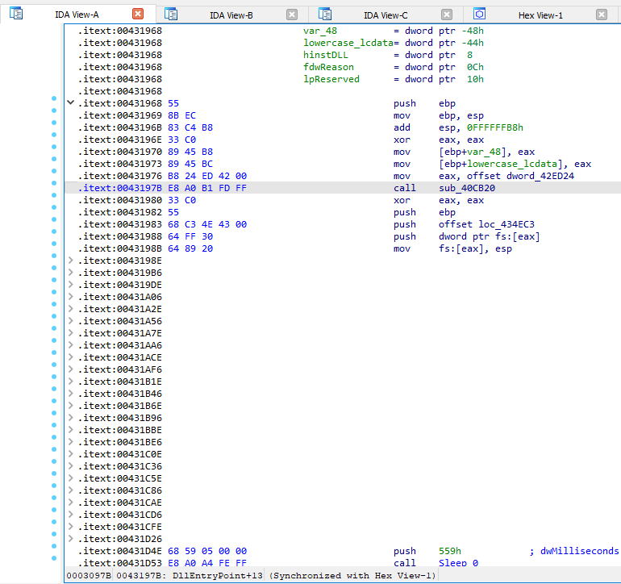

# astaroth-deobfuscator
IDA python script for deobfuscating Astaroth/Guildma injector DLL

When trying to analyze the injector DLL from a recent Astaroth/Guildma campaign (thanks to [this diary](https://isc.sans.edu/diary/More+Brazil+malspam+pushing+Astaroth+Guildma+in+January+2023/29404/) from SANS ISC), I came across a *really* annoying attempt at obfuscation. 

A function (which I called time_waster_3000) is called over 1,000 times (!!!) across the DLL. This function takes six hardcoded strings as arguments, alongside a random `word`. The function itself is a rabbit hole of arithmetics that serve no practical purpose as far as I could tell (aside from wasting a reverser's time). Here's how the `DLLEntry` looks with those annoying calls in place:

The purpose of this IDA python script is to hide all blocks of code that involve a call to this junk function, as well as its arguments. Here's how `DLLEntry` looks after the script is ran:

# Important considerations
- The script works by finding `call time_waster_3000`, therefore you need to either rename the junk function to follow that pattern or simply alter the script with the function name on the sample you're dealing with. For example, changing `idc.print_operand(x, 0) == 'time_waster_3000'` to `idc.print_operand(x, 0) == 'sub_431000'`.

- I've chosen to iterate over the `call time_waster_3000` instruction. The reason for this is simple: the hardcoded strings are present in multiple places across the binary; therefore, when I tried searching by push instructions involving said strings' offsets, the script wouldn't find all instances of this junk data.

- Right now the script works by hiding each repetition of the passing of arguments followed by `call time_waster_3000`. A better way would be to hide sequential occurrences of these junk instructions in one big block. I couldn't get that done with my little bird brain and this approach is better than nothing.
