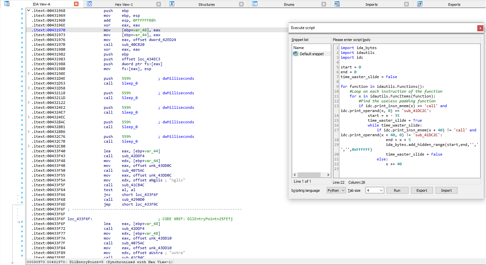

# astaroth-deobfuscator
IDA python script for deobfuscating Astaroth/Guildma injector DLL

When trying to analyze the injector DLL from a recent Astaroth/Guildma campaign (thanks to [this diary](https://isc.sans.edu/diary/More+Brazil+malspam+pushing+Astaroth+Guildma+in+January+2023/29404/) from SANS ISC), I came across a *really* annoying attempt at obfuscation. 

A function (which I called time_waster_3000 on the image below) is called over 1,000 times (!!!) across the DLL. This function takes six hardcoded strings as arguments, alongside a random `word`. The function itself is a rabbit hole of arithmetics that serve no practical purpose as far as I could tell (aside from wasting a reverser's time). Here's how the `DLLEntry` looks with those annoying calls in place:

The purpose of this IDA python script is to hide all blocks of code that involve a call to this junk function, as well as its arguments. Here's how `DLLEntry` looks after the script is ran:

# Important considerations
- The script works by finding a call to the padding function, represented by `call sub_CHANGEME` in the script. Therefore, you need to rename it in the script with the function name found on the sample you're dealing with. For example, changing `idc.print_operand(x, 0) == 'sub_CHANGEME'` to `idc.print_operand(x, 0) == 'sub_431000'`.

- I've chosen to iterate over the `call sub_CHANGEME` instruction instead of over argument pushes. The reason for this is simple: the hardcoded strings are present in multiple places across the binary; therefore, when I tried searching by push instructions involving said strings' offsets, the script wouldn't find all instances of this junk data.

- The script used to work by hiding each instance of the passing of arguments and call to the padding function as one collapsed block. Since the function is called multiple times back to back, that resulted in huge blank spaces in the disassembly view. I've updated it to hide sequential instances of this padding in one single collapsed block, which *really* improves readability.
